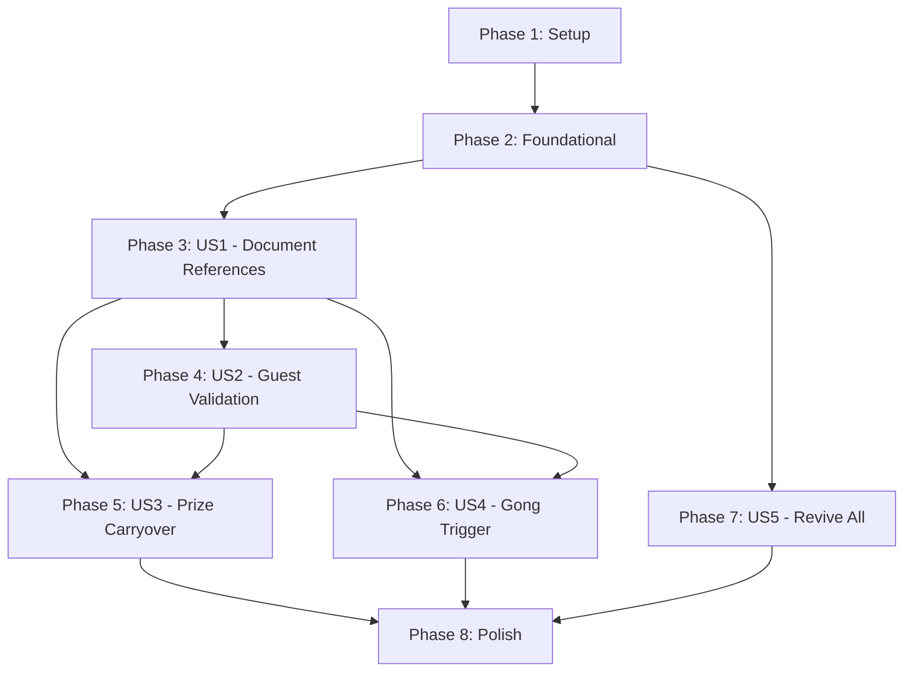

# Tasks: API Server Refinement

**Input**: Design documents from `/specs/002-api-server-refinement/`
**Prerequisites**: plan.md, spec.md, research.md, data-model.md, contracts/

**Organization**: Tasks are grouped by user story to enable independent implementation and testing of each story following TDD principles.

## Format: `- [ ] [ID] [P?] [Story?] Description`

- **[P]**: Can run in parallel (different files, no dependencies)
- **[Story]**: Which user story this task belongs to (e.g., US1, US2, US3)
- Include exact file paths in descriptions

## Path Conventions

This project uses monorepo structure:
- **API Server**: `apps/api-server/src/`, `apps/api-server/tests/`
- **Shared Types**: `packages/types/src/`
- **OpenAPI Specs**: `packages/openapi/`

---

## Phase 1: Setup (Shared Infrastructure)

**Purpose**: Copy implementation from 001-api-server branch and prepare for refactoring

**Tasks**:

- [X] T001 Checkout 001-api-server implementation to working directory (git worktree or merge from branch)
- [X] T002 [P] Install dependencies for apps/api-server using pnpm install
- [X] T003 [P] Copy OpenAPI spec from packages/openapi/api-server.yaml to working branch
- [X] T004 [P] Verify Firebase emulator configuration in apps/api-server/
- [X] T005 Run existing test suite to establish baseline (expected: some tests may fail, document current state)

**Checkpoint**: Existing 001-api-server code available and ready for refactoring

---

## Phase 2: Foundational (Blocking Prerequisites)

**Purpose**: Core infrastructure updates that MUST be complete before ANY user story refactoring

**⚠️ CRITICAL**: No user story work can begin until this phase is complete

**Tasks**:

- [X] T006 Update packages/types/src/GameState.ts to add prizeCarryover field and new phases (all_incorrect, all_revived)
- [X] T007 [P] Update packages/types/src/Guest.ts to change status enum from alive/eliminated to active/dropped
- [X] T008 [P] Update packages/types/src/Question.ts to add deadline field (Timestamp)
- [X] T009 [P] Update packages/types/src/Answer.ts documentation to reflect sub-collection storage location
- [X] T010 Create apps/api-server/src/services/firestoreRetry.ts implementing retry wrapper with p-retry library
- [X] T011 [P] Create apps/api-server/src/utils/performance.ts for response time tracking middleware
- [X] T012 [P] Update apps/api-server/package.json to add p-retry dependency (^6.1.0)
- [X] T013 Build packages/types to generate updated type definitions for api-server
- [X] T014 Update OpenAPI spec packages/openapi/api-server.yaml to v1.1.0 with schema changes (already done in contracts/)
- [X] T015 [P] Update apps/api-server/src/middleware/auth.ts to add authorize() function for role-based access control

**Checkpoint**: Foundation ready - types updated, retry logic available, auth enhanced

---

## Phase 3: User Story 1 - Correct Document References (Priority: P1) 🎯 MVP

**Goal**: Update all Firestore document paths and field names to align with refined data model

**Independent Test**: Verify Firestore reads/writes use gameState/live, answers in sub-collections, status uses active/dropped

**Why MVP**: Foundation for all other features - must be correct before implementing business logic

### Tests (TDD Red Phase)

- [X] T016 [US1] Update test in apps/api-server/tests/unit/services/gameStateService.test.ts to expect gameState/live document path
- [X] T017 [P] [US1] Update test in apps/api-server/tests/unit/services/answerService.test.ts to expect questions/{id}/answers/{guestId} sub-collection path
- [X] T018 [P] [US1] Update test in apps/api-server/tests/unit/services/guestService.test.ts to expect status values active/dropped
- [X] T019 [P] [US1] Update test mocks in apps/api-server/tests/integration/ to use new document paths
- [X] T020 [P] [US1] Update test fixtures in apps/api-server/tests/contract/ to use new field names and paths
- [X] T021 [US1] Run test suite and verify all path-related tests fail (RED state confirmed)

### Implementation (TDD Green Phase)

- [X] T022 [US1] Refactor apps/api-server/src/services/gameStateService.ts to read/write gameState/live instead of gameState/current
- [X] T023 [P] [US1] Refactor apps/api-server/src/services/answerService.ts to use sub-collection path questions/{questionId}/answers/{guestId}
- [X] T024 [P] [US1] Refactor apps/api-server/src/services/guestService.ts to use status values active/dropped in all queries and updates
- [X] T025 [P] [US1] Update apps/api-server/src/services/questionService.ts to reference sub-collection paths for answer aggregation
- [X] T026 [US1] Update seed script apps/api-server/scripts/seed-data.ts to use new paths and field values
- [X] T027 [US1] Run test suite and verify all path-related tests pass (GREEN state achieved)

### Verification

- [X] T028 [US1] Start Firebase emulator and verify seeded data appears in gameState/live document
- [X] T029 [US1] Test answer submission via API and verify it writes to sub-collection in Firestore UI
- [X] T030 [US1] Query guests collection and verify status field contains active or dropped values

**Story Completion**: All Firestore operations use correct paths and field names (SC-001, SC-002, SC-003)

---

## Phase 4: User Story 2 - Guest Status Validation (Priority: P1)

**Goal**: Implement validation to ensure only active guests can submit answers and phase must be accepting_answers

**Independent Test**: Mark guest as dropped and attempt answer submission → expect 403 error

**Dependencies**: US1 (requires correct status field names)

### Tests (TDD Red Phase)

- [X] T031 [US2] Write test in apps/api-server/tests/unit/services/answerService.test.ts: active guest + accepting_answers phase → accept answer
- [X] T032 [P] [US2] Write test: dropped guest + accepting_answers phase → reject with 403 "Guest is no longer active"
- [X] T033 [P] [US2] Write test: active guest + showing_results phase → reject with 400 "Not accepting answers in current phase"
- [X] T034 [P] [US2] Write test: answer submission after deadline → reject with 400 "Answer deadline has passed"
- [X] T035 [US2] Run tests and verify all validation tests fail (RED state)

### Implementation (TDD Green Phase)

- [X] T036 [US2] Add guest status validation to apps/api-server/src/services/answerService.ts submitAnswer() method
- [X] T037 [P] [US2] Add game phase validation to answerService.ts submitAnswer() method
- [X] T038 [P] [US2] Add deadline validation to answerService.ts submitAnswer() method using Question.deadline field
- [X] T039 [P] [US2] Update apps/api-server/src/routes/guest.ts POST /answer endpoint to return appropriate HTTP status codes
- [X] T040 [US2] Run tests and verify all validation tests pass (GREEN state)

### Integration Testing

- [X] T041 [US2] Write integration test in apps/api-server/tests/integration/routes/guest.integration.test.ts for dropped guest rejection
- [X] T042 [P] [US2] Write integration test for phase validation
- [X] T043 [US2] Run integration tests with Firebase emulator and verify 403/400 errors returned correctly

**Story Completion**: Dropped guests cannot submit answers, phase validation enforced (SC-004, FR-005, FR-006)

---

## Phase 5: User Story 3 - Prize Carryover on All Incorrect (Priority: P2)

**Goal**: Implement all-incorrect detection and prize carryover accumulation logic

**Independent Test**: Submit all wrong answers → verify prizeCarryover increases, all guests remain active, phase becomes all_incorrect

**Dependencies**: US1 (requires prizeCarryover field), US2 (requires answer submission validation)

### Tests (TDD Red Phase)

- [X] T044 [US3] Write test in apps/api-server/tests/unit/services/prizeCarryover.test.ts: all guests answer incorrectly → prizeCarryover increases by question prize
- [X] T045 [P] [US3] Write test: all guests remain status=active when all incorrect
- [X] T046 [P] [US3] Write test: phase transitions to all_incorrect after all-incorrect result calculation
- [X] T047 [P] [US3] Write test: next question prize = basePrize + prizeCarryover
- [X] T048 [P] [US3] Write test: prizeCarryover resets to 0 after question with any correct answers
- [X] T049 [US3] Run tests and verify prize carryover tests fail (RED state)

### Implementation (TDD Green Phase)

- [X] T050 [US3] Implement all-incorrect detection in apps/api-server/src/services/questionService.ts calculateResults() method
- [X] T051 [P] [US3] Update gameStateService.ts to add prize to prizeCarryover when all incorrect
- [X] T052 [P] [US3] Update gameStateService.ts to set phase=all_incorrect after all-incorrect results
- [X] T053 [P] [US3] Update questionService.ts to calculate total prize as basePrize + gameState.prizeCarryover when starting new question
- [X] T054 [P] [US3] Update questionService.ts to reset prizeCarryover=0 after results with any correct answers
- [X] T055 [US3] Run tests and verify prize carryover logic passes (GREEN state)

### Integration Testing

- [X] T056 [US3] Write integration test: create question, submit all wrong answers, verify prizeCarryover updated
- [X] T057 [P] [US3] Write integration test: verify accumulated prizeCarryover from multiple consecutive all-incorrect questions
- [X] T058 [US3] Run integration tests and verify prize accumulation works end-to-end

**Story Completion**: All-incorrect questions correctly accumulate prize (SC-005, FR-009, FR-010)

---

## Phase 6: User Story 4 - Gong Trigger Behavior (Priority: P2)

**Goal**: Implement gong trigger logic with worst performer elimination and gong deactivation

**Independent Test**: Trigger gong with mixed answers → verify worst performer dropped, isGongActive becomes false

**Dependencies**: US1 (requires isGongActive field), US2 (requires guest status updates)

### Tests (TDD Red Phase)

- [X] T059 [US4] Write test in apps/api-server/tests/unit/services/gameStateService.test.ts: gong active + mixed answers → worst performer(s) get status=dropped
- [X] T060 [P] [US4] Write test: gong trigger sets isGongActive=false
- [X] T061 [P] [US4] Write test: gong inactive → reject TRIGGER_GONG with 400 "Gong is no longer active"
- [X] T062 [P] [US4] Write test: all guests correct with gong → nobody eliminated (based on clarification Q3)
- [X] T063 [P] [US4] Write test: all guests incorrect with gong → nobody eliminated (based on clarification Q3)
- [X] T064 [P] [US4] Write test: multiple guests tied for worst → all eliminated
- [X] T065 [US4] Run tests and verify gong behavior tests fail (RED state)

### Implementation (TDD Green Phase)

- [X] T066 [US4] Implement worst performer calculation in apps/api-server/src/services/questionService.ts for gong-triggered questions
- [X] T067 [P] [US4] Add logic to identify guests with incorrect answers (worst performers) when gong is active
- [X] T068 [P] [US4] Update guestService.ts to support batch dropping of multiple guests (for tie scenarios)
- [X] T069 [P] [US4] Update gameStateService.ts to set isGongActive=false after gong is triggered
- [X] T070 [P] [US4] Add gong validation to apps/api-server/src/routes/admin.ts or host.ts TRIGGER_GONG endpoint
- [X] T071 [US4] Run tests and verify gong trigger logic passes (GREEN state)

### Integration Testing

- [ ] T072 [US4] Write integration test: trigger gong, submit mixed answers, verify worst performer dropped and gong inactive
- [ ] T073 [P] [US4] Write integration test: attempt TRIGGER_GONG when inactive → expect 400 error
- [ ] T074 [US4] Run integration tests and verify gong mechanics work end-to-end

**Story Completion**: Gong trigger correctly eliminates worst performers and deactivates (SC-006, FR-011, FR-012)

---

## Phase 7: User Story 5 - Revive All Guests (Priority: P3)

**Goal**: Implement REVIVE_ALL endpoint that sets all guests to active using Firestore batch write

**Independent Test**: Drop multiple guests, call REVIVE_ALL, verify all guests become active and phase=all_revived

**Dependencies**: US1 (requires guest status field)

### Tests (TDD Red Phase)

- [X] T075 [US5] Write test in apps/api-server/tests/unit/services/guestService.test.ts: reviveAll() sets all guests to status=active
- [X] T076 [P] [US5] Write test: reviveAll() uses Firestore batch write (not individual updates)
- [X] T077 [P] [US5] Write test: reviveAll() is idempotent (no-op if all already active)
- [X] T078 [P] [US5] Write test: gameState phase transitions to all_revived after REVIVE_ALL
- [X] T079 [US5] Run tests and verify REVIVE_ALL tests fail (RED state)

### Implementation (TDD Green Phase)

- [ ] T080 [US5] Implement reviveAll() method in apps/api-server/src/services/guestService.ts using Firestore batch write
- [ ] T081 [P] [US5] Update gameStateService.ts to set phase=all_revived after REVIVE_ALL action
- [ ] T082 [P] [US5] Add REVIVE_ALL action to apps/api-server/src/routes/host.ts or admin.ts endpoint
- [ ] T083 [P] [US5] Add authorization check to REVIVE_ALL endpoint (host role only)
- [ ] T084 [US5] Run tests and verify REVIVE_ALL logic passes (GREEN state)

### Integration Testing

- [ ] T085 [US5] Write integration test: drop 3 guests, call REVIVE_ALL endpoint, verify all 5 guests active
- [ ] T086 [P] [US5] Write integration test: call REVIVE_ALL when all active → verify no errors, idempotent behavior
- [ ] T087 [US5] Run integration tests and verify batch write atomicity

**Story Completion**: REVIVE_ALL successfully updates all guests atomically (SC-007, FR-013)

---

## Phase 8: Polish & Cross-Cutting Concerns

**Purpose**: Add retry logic, performance monitoring, error handling, and finalize OpenAPI specs

**Dependencies**: All user stories complete

### Retry Logic & Error Handling

- [ ] T088 [P] Wrap all Firestore read operations in apps/api-server/src/services/ with withFirestoreRetry() from firestoreRetry.ts
- [ ] T089 [P] Wrap all Firestore write operations with withFirestoreRetry()
- [ ] T090 [P] Wrap all Firestore transaction operations with withFirestoreRetry()
- [ ] T091 [P] Update apps/api-server/src/middleware/errorHandler.ts to return 503 with Retry-After header for Firestore failures
- [ ] T092 Write test: Firestore UNAVAILABLE error triggers 3 retry attempts then returns 503
- [ ] T093 [P] Write test: Firestore PERMISSION_DENIED error aborts immediately without retry
- [ ] T094 Run retry logic tests and verify exponential backoff behavior

### Performance Monitoring

- [ ] T095 [P] Add performance.ts middleware to Express app in apps/api-server/src/app.ts
- [ ] T096 [P] Implement response time logging in performance.ts with P95 calculation
- [ ] T097 [P] Add performance assertions to integration tests (verify P95 < 500ms for reads, < 1000ms for writes)
- [ ] T098 Run performance tests with Firebase emulator and verify latency targets

### Authentication & Authorization

- [ ] T099 [P] Update authenticate() middleware to verify Firebase ID tokens
- [ ] T100 [P] Add custom claims extraction for guest/host roles in auth.ts
- [ ] T101 [P] Apply authorize('host') to admin/host-only endpoints (REVIVE_ALL, TRIGGER_GONG, etc.)
- [ ] T102 [P] Apply authenticate() to all endpoints (answer submission, etc.)
- [ ] T103 Write test: unauthenticated request → 401 error
- [ ] T104 [P] Write test: guest tries to call host endpoint → 403 error
- [ ] T105 Run auth tests and verify role-based access control

### OpenAPI Contract Validation

- [ ] T106 [P] Validate updated OpenAPI spec with swagger-cli validate packages/openapi/api-server.yaml
- [ ] T107 [P] Update contract tests in apps/api-server/tests/contract/ to validate against OpenAPI v1.1.0
- [ ] T108 [P] Generate TypeScript types from OpenAPI spec using openapi-typescript (optional)
- [ ] T109 Run contract tests and verify implementation matches OpenAPI spec

### Final Validation

- [ ] T110 Run full test suite (unit + integration + contract) and verify 100% pass rate
- [ ] T111 [P] Run linter (pnpm lint) and fix any issues
- [ ] T112 [P] Run formatter (pnpm format) on all modified files
- [ ] T113 [P] Build TypeScript (pnpm build) and verify no compilation errors
- [ ] T114 Start Firebase emulator and perform manual smoke testing of all user stories
- [ ] T115 [P] Update apps/api-server/README.md with refactoring notes and migration guide
- [ ] T116 Generate test coverage report and verify coverage maintained or improved from baseline

**Phase Complete**: All cross-cutting concerns implemented, tests passing, ready for deployment

---

## Task Summary

**Total Tasks**: 116
**By Phase**:
- Phase 1 (Setup): 5 tasks
- Phase 2 (Foundational): 10 tasks
- Phase 3 (US1 - Document References): 15 tasks
- Phase 4 (US2 - Guest Validation): 13 tasks
- Phase 5 (US3 - Prize Carryover): 15 tasks
- Phase 6 (US4 - Gong Trigger): 16 tasks
- Phase 7 (US5 - Revive All): 13 tasks
- Phase 8 (Polish): 29 tasks

**By User Story**:
- US1 (Correct Document References): 15 tasks - 🎯 **MVP SCOPE**
- US2 (Guest Status Validation): 13 tasks
- US3 (Prize Carryover): 15 tasks
- US4 (Gong Trigger): 16 tasks
- US5 (Revive All): 13 tasks
- Infrastructure/Polish: 44 tasks

**Parallel Opportunities**: 48 tasks marked [P] can run in parallel

**TDD Compliance**: All user story phases follow RED (write tests) → GREEN (implement) → REFACTOR pattern

---

## Dependency Graph

**Critical Path**: Setup → Foundation → US1 → US2 → US3/US4 → Polish

**Parallelizable Stories**: US3, US4, US5 can be implemented in parallel after US2 is complete

**MVP Delivery**: Phase 1 + Phase 2 + Phase 3 (US1 only) = **30 tasks** for minimal viable refactoring

---

## Implementation Strategy

### MVP First (Recommended)

Implement **only US1** first to establish correct data model:
1. Complete Phase 1 (Setup): 5 tasks
2. Complete Phase 2 (Foundational): 10 tasks
3. Complete Phase 3 (US1): 15 tasks
4. **Total: 30 tasks for MVP**

**MVP Validation**: All Firestore operations use correct paths and field names (SC-001, SC-002, SC-003)

### Incremental Delivery

After MVP, deliver in priority order:
1. **Increment 2**: Add US2 (Guest Validation) - 13 tasks
2. **Increment 3**: Add US3 + US4 in parallel (Prize Carryover + Gong) - 31 tasks
3. **Increment 4**: Add US5 (Revive All) - 13 tasks
4. **Final**: Polish & Cross-cutting - 29 tasks

### Parallel Execution Examples

**During US3 & US4 (after US2 complete)**:
- Developer A: T044-T058 (Prize Carryover)
- Developer B: T059-T074 (Gong Trigger)
- No conflicts - different files and business logic

**During Polish Phase**:
- Developer A: T088-T094 (Retry Logic)
- Developer B: T095-T098 (Performance Monitoring)
- Developer C: T099-T105 (Authentication)
- Developer D: T106-T109 (OpenAPI Validation)

---

## Constitution Compliance Checklist

- ✅ **Principle I (Monorepo Architecture)**: All tasks reference apps/api-server and packages/ correctly
- ✅ **Principle II (TDD)**: Each user story phase follows RED → GREEN → REFACTOR pattern with explicit test tasks
- ✅ **Principle III (OpenAPI-First)**: Phase 8 includes OpenAPI validation tasks (T106-T109)
- ✅ **Principle IV (Code Quality Gates)**: Phase 8 includes linting, formatting, and build tasks (T111-T113)
- ✅ **Principle V (Shell Command Safety)**: No new shell commands introduced, existing Firebase emulator scripts reused

---

## Success Metrics

Upon completion of all tasks:
- **SC-001-SC-003**: All Firestore operations use correct paths and field names ✓
- **SC-004**: Dropped guests receive 403 errors (100% rejection rate) ✓
- **SC-005**: All-incorrect questions correctly update prizeCarryover ✓
- **SC-006**: Gong trigger eliminates worst performer and deactivates ✓
- **SC-007**: REVIVE_ALL uses batch writes ✓
- **SC-008**: Phase transitions use Firestore transactions ✓
- **SC-009**: Stateless architecture maintained ✓
- **SC-010**: 100% test pass rate ✓
- **SC-011**: P95 latency < 500ms for reads ✓
- **SC-012**: P95 latency < 1000ms for writes ✓

---

## Notes

- **Test Strategy**: This implementation follows strict TDD - tests are written before implementation code for all user stories
- **Refactoring Focus**: Most tasks update existing code from 001-api-server rather than creating new files
- **Breaking Changes**: This refactoring introduces breaking changes to Firestore schema - coordinate deployment with socket-server, admin-app, and client apps
- **Migration**: Phase 1 includes task to merge/copy from 001-api-server branch - coordinate with team on git workflow
