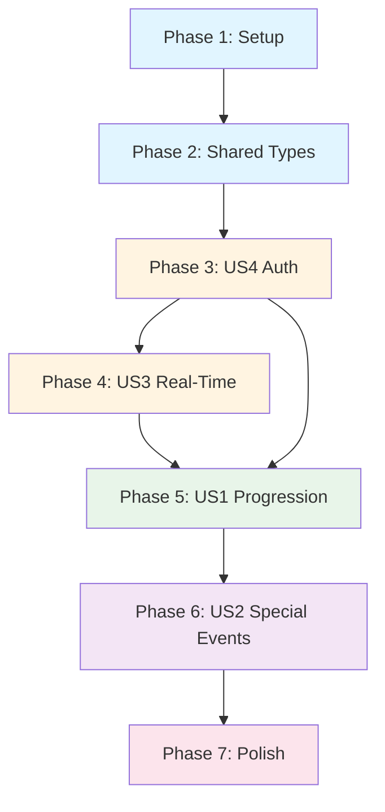

# Tasks: Host Control App

**Feature**: 006-host-app | **Generated**: 2025-11-04 | **Status**: Ready for implementation

This task breakdown follows a Test-Driven Development (TDD) approach where tests are written BEFORE implementation. Tasks are organized by implementation phases with user story groupings. Dependencies are managed through phase ordering.

---

## Task Summary

- **Total Tasks**: 91
- **Parallelizable Tasks**: 45 (marked with [P])
- **User Stories**: 4 (US1-P1, US2-P2, US3-P1, US4-P1)
- **Estimated Phases**: 7

---

## Phase 1: Project Setup & Infrastructure (Foundation)

**Goal**: Initialize project structure, dependencies, and base configuration files.

**Duration Estimate**: 2-3 hours
**Parallel Opportunities**: Many tasks can run in parallel after T001

- [X] T001 Create apps/host-app/ directory structure per plan.md project structure
- [X] T002 [P] Initialize Vite project with React + TypeScript template in apps/host-app/
- [X] T003 [P] Create package.json with dependencies: react@18.2, react-dom@18.2, vite@5.0, typescript@5.3
- [X] T004 [P] Add Firebase dependencies: firebase@10.7+, @firebase/auth, @firebase/firestore
- [X] T005 [P] Add testing dependencies: vitest@1.0+, @testing-library/react, @testing-library/jest-dom, jsdom
- [X] T006 [P] Add E2E testing dependency: @playwright/test
- [X] T007 [P] Add routing dependency: react-router-dom@6.x
- [X] T008 [P] Add monitoring dependency: @sentry/react (per research.md Decision #3)
- [X] T009 [P] Configure tsconfig.json with strict mode, exactOptionalPropertyTypes, and React JSX settings
- [X] T010 [P] Configure .eslintrc.cjs with React + TypeScript rules matching participant-app
- [X] T011 [P] Configure .prettierrc for code formatting
- [X] T012 [P] Create .env.example with Firebase config placeholders (API_KEY, AUTH_DOMAIN, PROJECT_ID, etc.)
- [X] T013 [P] Configure vite.config.ts with React plugin and environment variable handling
- [X] T014 [P] Configure vitest.config.ts with jsdom environment and React Testing Library setup
- [X] T015 [P] Configure playwright.config.ts with tablet viewport (768-1024px) and emulation settings
- [X] T016 [P] Create apps/host-app/public/index.html with tablet viewport meta tags
- [X] T017 [P] Create apps/host-app/index.html as Vite entry point
- [X] T018 [P] Setup pre-commit hooks with lint and format checks
- [X] T019 Install all dependencies with pnpm install from repository root
- [X] T020 Verify build with pnpm build in apps/host-app/

---

## Phase 2: Shared Types & Foundational Libraries (Blocking Prerequisites)

**Goal**: Create shared TypeScript types and core infrastructure libraries that all features depend on.

**Duration Estimate**: 3-4 hours
**Dependencies**: Phase 1 must be complete
**Parallel Opportunities**: T021-T024 can run in parallel, then T025-T030 after types exist

- [X] T021 [P] Create packages/types/src/GameState.ts with GamePhase enum and GameState interface
- [X] T022 [P] Create packages/types/src/Question.ts with Question and QuestionChoice interfaces
- [X] T023 [P] Create packages/types/src/HostApi.ts with HostAction enum, HostActionRequest, HostActionResponse
- [X] T024 [P] Update packages/types/src/index.ts to re-export GameState, Question, HostApi types
- [X] T025 [P] Create apps/host-app/src/lib/firebase.ts with Firebase SDK initialization (Auth, Firestore)
- [X] T026 [P] Add emulator connection logic to firebase.ts when VITE_USE_EMULATOR=true (per quickstart.md)
- [X] T027 [P] Create apps/host-app/src/lib/logger.ts with Sentry initialization and error logging functions
- [X] T028 [P] Create apps/host-app/src/types/index.ts to re-export types from @allstars/types
- [X] T029 Write unit tests for logger.ts in tests/unit/lib/logger.test.ts
- [X] T030 Create apps/host-app/src/components/layout/ErrorBoundary.tsx with React error boundary + Sentry reporting
- [X] T031 Write unit tests for ErrorBoundary.tsx in tests/unit/components/layout/ErrorBoundary.test.tsx
- [X] T032 Create apps/host-app/src/main.tsx as app entry point with ErrorBoundary wrapper
- [X] T033 Create apps/host-app/src/App.tsx with basic routing structure (React Router setup)
- [X] T034 Verify app builds and runs with pnpm dev

---

## Phase 3: User Story 4 - Secure Host Authentication (P1, Prerequisite)

**Goal**: Implement Google Login authentication flow, session management, and route protection. This is a prerequisite for all other user stories.

**Duration Estimate**: 4-5 hours
**Dependencies**: Phase 2 complete
**Parallel Opportunities**: Tests (T035-T037) can be written in parallel, then implementation (T038-T043)

### US4 Testing (TDD: Write tests first)

- [ ] T035 [P] [US4] Write unit tests for useAuth hook in tests/unit/hooks/useAuth.test.ts (login, logout, token refresh, session persistence)
- [ ] T036 [P] [US4] Write integration tests for Firebase Auth flow in tests/integration/firebase-auth.test.ts (Google sign-in with emulator)
- [ ] T037 [P] [US4] Write E2E test for login flow in tests/e2e/login-flow.spec.ts (tablet viewport, full auth flow)

### US4 Implementation

- [ ] T038 [US4] Create apps/host-app/src/hooks/useAuth.ts with Firebase Authentication logic (RED - tests should fail)
- [ ] T039 [US4] Implement Google sign-in with Firebase Auth signInWithPopup() in useAuth.ts
- [ ] T040 [US4] Implement session persistence to localStorage in useAuth.ts (save/restore idToken, tokenExpiresAt)
- [ ] T041 [US4] Implement automatic token refresh logic in useAuth.ts (check tokenExpiresAt, call getIdToken(true))
- [ ] T042 [US4] Implement logout with Firebase signOut() and localStorage.clear() in useAuth.ts
- [ ] T043 Run unit tests for useAuth - verify GREEN state (all tests pass)
- [ ] T044 [US4] Create apps/host-app/src/components/auth/GoogleLoginButton.tsx with Firebase sign-in UI
- [ ] T045 [US4] Style GoogleLoginButton.tsx with tablet-friendly design (44x44px touch target per NFR-005)
- [ ] T046 [US4] Create apps/host-app/src/components/layout/ProtectedRoute.tsx with auth guard (redirect to login if not authenticated)
- [ ] T047 [US4] Create apps/host-app/src/pages/LoginPage.tsx with GoogleLoginButton and branding
- [ ] T048 [US4] Update App.tsx routing to use ProtectedRoute for /control route
- [ ] T049 Run integration tests for firebase-auth - verify GREEN state
- [ ] T050 Run E2E test for login-flow - verify GREEN state
- [ ] T051 [US4] Add authentication event logging to logger.ts (login success, failure, session expiration per FR-028)
- [ ] T052 Manual verification: Test Google Login on iPad/Android tablet with emulator

**Acceptance Criteria**:
- ✅ FR-001: Google Login required before access
- ✅ FR-003: Unauthenticated users cannot access controls
- ✅ FR-004: Session expiration prompts re-auth without losing state view
- ✅ FR-028: Authentication events logged to monitoring service

---

## Phase 4: User Story 3 - Monitor Real-Time Game State (P1, Prerequisite)

**Goal**: Implement Firestore listener for real-time game state synchronization. This is a prerequisite for US1 (question progression) as the UI needs to react to state changes.

**Duration Estimate**: 4-5 hours
**Dependencies**: Phase 3 complete (authentication required for Firestore access)
**Parallel Opportunities**: Tests (T053-T055) can be written in parallel, then implementation (T056-T064)

### US3 Testing (TDD: Write tests first)

- [ ] T053 [P] [US3] Write unit tests for useGameState hook in tests/unit/hooks/useGameState.test.ts (onSnapshot lifecycle, state updates, reconnection)
- [ ] T054 [P] [US3] Write integration tests for Firestore listener in tests/integration/firestore-listener.test.ts (real-time sync with emulator)
- [ ] T055 [P] [US3] Write unit tests for display components in tests/unit/components/display/ (GamePhaseDisplay, QuestionDisplay)

### US3 Implementation

- [ ] T056 [US3] Create apps/host-app/src/hooks/useGameState.ts with Firestore onSnapshot() listener for gameState/live (RED - tests should fail)
- [ ] T057 [US3] Implement automatic reconnection logic in useGameState.ts (handle onSnapshot errors, retry connection)
- [ ] T058 [US3] Implement proper cleanup in useGameState.ts (unsubscribe listener on unmount)
- [ ] T059 Run unit tests for useGameState - verify GREEN state
- [ ] T060 [US3] Create apps/host-app/src/components/display/GamePhaseDisplay.tsx to show currentPhase prominently (per FR-017)
- [ ] T061 [US3] Create apps/host-app/src/components/display/QuestionDisplay.tsx to show currentQuestion details (per FR-018)
- [ ] T062 [US3] Create apps/host-app/src/components/display/LoadingSpinner.tsx with action name display (per FR-020)
- [ ] T063 Run unit tests for display components - verify GREEN state
- [ ] T064 Run integration tests for firestore-listener - verify GREEN state
- [ ] T065 [US3] Add Firestore connection event logging to logger.ts (connection failures, reconnection per FR-031)
- [ ] T066 Manual verification: Update gameState/live in Firestore emulator UI, verify host-app updates within 1 second (SC-002)

**Acceptance Criteria**:
- ✅ FR-005: Firestore listener established on authentication
- ✅ FR-006: UI updates automatically on gameState changes
- ✅ FR-007: UI reflects phase changes within 1 second
- ✅ FR-008: Listener maintained throughout session
- ✅ FR-009: Auto-reconnect on connection loss
- ✅ FR-010a: Multiple hosts see synchronized state
- ✅ FR-017: Current phase displayed prominently
- ✅ FR-018: Current question displayed when active
- ✅ FR-023: Error message if listener fails
- ✅ FR-024: Manual reconnect option
- ✅ FR-031: Listener failures logged
- ✅ SC-002: UI updates within 1 second
- ✅ SC-011: Concurrent hosts synchronized within 1 second

---

## Phase 5: User Story 1 - Start and Progress Through Questions (P1, MVP Core)

**Goal**: Implement the context-aware "Next" button and API client for game progression. This is the core MVP functionality.

**Duration Estimate**: 6-7 hours
**Dependencies**: Phase 3 (auth) and Phase 4 (game state) complete
**Parallel Opportunities**: Tests (T067-T070) can be written in parallel, then implementation layers

### US1 Testing (TDD: Write tests first)

- [ ] T067 [P] [US1] Write unit tests for api-client.ts in tests/unit/lib/api-client.test.ts (10s timeout, fail-fast, no retry per FR-027, NFR-008)
- [ ] T068 [P] [US1] Write unit tests for useApiClient hook in tests/unit/hooks/useApiClient.test.ts (action dispatch, loading states, error handling)
- [ ] T069 [P] [US1] Write unit tests for phase-utils.ts in tests/unit/utils/phase-utils.test.ts (phase-to-button-label mapping per FR-010)
- [ ] T070 [P] [US1] Write E2E test for question cycle in tests/e2e/question-cycle.spec.ts (advance through all phases, verify <10s per SC-001)

### US1 Foundational Implementation

- [ ] T071 [US1] Create apps/host-app/src/lib/api-client.ts with fetch() + AbortController for 10s timeout (RED - tests should fail)
- [ ] T072 [US1] Implement fail-fast error handling in api-client.ts (no automatic retry per research.md Decision #2)
- [ ] T073 [US1] Add Authorization: Bearer header injection in api-client.ts using Firebase ID token (per FR-002)
- [ ] T074 Run unit tests for api-client.ts - verify GREEN state
- [ ] T075 [US1] Create apps/host-app/src/utils/phase-utils.ts with getButtonLabel(currentPhase) function (per FR-010)
- [ ] T076 [US1] Create apps/host-app/src/utils/error-handlers.ts with displayError() and retry logic
- [ ] T077 Run unit tests for phase-utils and error-handlers - verify GREEN state

### US1 API Client Hook

- [ ] T078 [US1] Create apps/host-app/src/hooks/useApiClient.ts with advanceGame(action, payload) function
- [ ] T079 [US1] Implement loading state management in useApiClient.ts (isLoading, actionName for spinner per FR-020)
- [ ] T080 [US1] Implement error state management in useApiClient.ts (error message display per FR-025, FR-026)
- [ ] T081 [US1] Add API request failure logging to useApiClient.ts (per FR-029)
- [ ] T082 Run unit tests for useApiClient - verify GREEN state

### US1 BigButton Component

- [ ] T083 [US1] Create apps/host-app/src/components/control/BigButton.tsx with context-aware label (use phase-utils)
- [ ] T084 [US1] Implement button action dispatch in BigButton.tsx (call useApiClient with correct action per FR-011)
- [ ] T085 [US1] Implement button disable on tap until state update in BigButton.tsx (prevent spam per FR-022)
- [ ] T086 [US1] Style BigButton.tsx for tablet (44x44px minimum, large touch target per NFR-005)
- [ ] T087 [US1] Integrate LoadingSpinner in BigButton.tsx (show spinner with action name per FR-020)
- [ ] T088 [US1] Write unit tests for BigButton.tsx in tests/unit/components/control/BigButton.test.tsx
- [ ] T089 Run unit tests for BigButton - verify GREEN state

### US1 Page Integration

- [ ] T090 [US1] Create apps/host-app/src/pages/ControlPanelPage.tsx with BigButton, GamePhaseDisplay, QuestionDisplay
- [ ] T091 [US1] Add error display to ControlPanelPage.tsx with retry button (per FR-025, FR-026)
- [ ] T092 [US1] Add critical state transition logging to ControlPanelPage.tsx (per FR-030)
- [ ] T093 Run integration tests for API client with mock server in tests/integration/api-integration.test.ts
- [ ] T094 Run E2E test for question-cycle - verify GREEN state (complete cycle in <10s per SC-001)
- [ ] T095 Manual verification: Advance through all 7 phases on tablet, verify button labels match FR-010

**Acceptance Criteria**:
- ✅ FR-002: Firebase ID token in Authorization header
- ✅ FR-010: Context-aware button labels
- ✅ FR-011: Correct action payloads sent
- ✅ FR-012: UI waits for Firestore update (no immediate local update)
- ✅ FR-020: Loading spinner with action name
- ✅ FR-021: Error messages displayed clearly
- ✅ FR-022: Button disabled after tap until state update
- ✅ FR-025: API error messages displayed
- ✅ FR-026: Retry option for failed actions
- ✅ FR-027: No automatic retry (fail-fast)
- ✅ FR-029: API failures logged
- ✅ FR-030: State transitions logged
- ✅ NFR-008: API timeout after 10 seconds
- ✅ SC-001: Question cycle in <10 seconds
- ✅ SC-004: 100% of API requests include valid token
- ✅ SC-010: Button labels match phase 100% of the time

---

## Phase 6: User Story 2 - Trigger Special Game Events (P2, Enhancement)

**Goal**: Implement TRIGGER_GONG and REVIVE_ALL buttons for special game actions.

**Duration Estimate**: 3-4 hours
**Dependencies**: Phase 5 complete (uses same API client infrastructure)
**Parallel Opportunities**: Tests (T096-T097) can be written in parallel, then implementation (T098-T103)

### US2 Testing (TDD: Write tests first)

- [ ] T096 [P] [US2] Write unit tests for GongButton.tsx in tests/unit/components/control/GongButton.test.tsx
- [ ] T097 [P] [US2] Write unit tests for ReviveAllButton.tsx in tests/unit/components/control/ReviveAllButton.test.tsx

### US2 Implementation

- [ ] T098 [US2] Create apps/host-app/src/components/control/GongButton.tsx with TRIGGER_GONG action (RED - tests should fail)
- [ ] T099 [US2] Add visibility logic to GongButton.tsx (only show during accepting_answers phase per FR-013)
- [ ] T100 [US2] Style GongButton.tsx for tablet with 44x44px touch target
- [ ] T101 Run unit tests for GongButton - verify GREEN state
- [ ] T102 [US2] Create apps/host-app/src/components/control/ReviveAllButton.tsx with REVIVE_ALL action (RED - tests should fail)
- [ ] T103 [US2] Position ReviveAllButton.tsx in corner of screen (always visible per FR-015)
- [ ] T104 [US2] Style ReviveAllButton.tsx for tablet with 44x44px touch target
- [ ] T105 Run unit tests for ReviveAllButton - verify GREEN state
- [ ] T106 [US2] Add GongButton and ReviveAllButton to ControlPanelPage.tsx
- [ ] T107 Manual verification: Trigger gong during accepting_answers phase, verify isGongActive=true in Firestore
- [ ] T108 Manual verification: Trigger REVIVE_ALL, verify phase transitions to all_revived → ready_for_next

**Acceptance Criteria**:
- ✅ FR-013: TRIGGER_GONG button visible during accepting_answers
- ✅ FR-014: TRIGGER_GONG action sent correctly
- ✅ FR-015: REVIVE_ALL button always visible in corner
- ✅ FR-016: REVIVE_ALL action sent correctly
- ✅ SC-005: Gong and revive succeed without disruption

---

## Phase 7: Polish, Cross-Cutting Concerns, and Final Validation

**Goal**: Complete remaining non-functional requirements, E2E testing, and final validations.

**Duration Estimate**: 4-5 hours
**Dependencies**: All previous phases complete
**Parallel Opportunities**: Many tasks can run in parallel (styling, testing, documentation)

### Responsive Design & Tablet Optimization

- [ ] T109 [P] Add tablet-optimized CSS to all components (768-1024px viewport per NFR-001)
- [ ] T110 [P] Add portrait and landscape orientation support with media queries (per NFR-002)
- [ ] T111 [P] Verify all touch targets are 44x44px minimum (per NFR-005, SC-007)
- [ ] T112 Manual verification: Test on iPad Safari and Android Chrome (per NFR-004, SC-008)

### Performance & Interaction Responsiveness

- [ ] T113 [P] Add interaction debouncing to ensure <200ms response time (per NFR-003, SC-012)
- [ ] T114 [P] Optimize React re-renders with React.memo() and useMemo() where appropriate
- [ ] T115 Manual verification: Measure button tap to UI feedback latency (<200ms per NFR-003)

### Concurrent Host Session Testing

- [ ] T116 [US3] Write E2E test for concurrent hosts in tests/e2e/concurrent-hosts.spec.ts
- [ ] T117 [US3] Implement multi-device simulation in concurrent-hosts.spec.ts (2 browser contexts)
- [ ] T118 Run E2E test for concurrent-hosts - verify synchronized state within 1 second (SC-011)
- [ ] T119 Manual verification: Open 2 tablets, log in as different hosts, verify synchronized screens

### Error Handling Edge Cases

- [ ] T120 [P] Test and handle unknown phase values gracefully (per clarification question 6)
- [ ] T121 [P] Test and handle data corruption scenarios (invalid phase transitions)
- [ ] T122 [P] Test and handle network disconnection during critical transitions (per clarification question 2)
- [ ] T123 Add reconnection UI feedback (display "Reconnecting..." message during outage)
- [ ] T124 Verify auto-reconnect within 5 seconds of connectivity restoration (SC-006)

### Logging & Observability Validation

- [ ] T125 [P] Verify all FR-028 authentication events are logged correctly
- [ ] T126 [P] Verify all FR-029 API failures are logged with error details
- [ ] T127 [P] Verify all FR-030 critical state transitions are logged
- [ ] T128 [P] Verify all FR-031 Firestore connection events are logged
- [ ] T129 Manual verification: Trigger each log event and verify in Sentry dashboard

### Final Integration & Acceptance Testing

- [ ] T130 Run full test suite: pnpm test (unit + integration tests)
- [ ] T131 Run full E2E suite: pnpm test:e2e (login-flow, question-cycle, concurrent-hosts)
- [ ] T132 Run linting: pnpm lint
- [ ] T133 Run formatting check: pnpm format:check
- [ ] T134 Build for production: pnpm build
- [ ] T135 Preview production build: pnpm preview (verify no runtime errors)

### Documentation & Developer Experience

- [ ] T136 [P] Verify quickstart.md instructions work with fresh clone (Firebase emulator setup, pnpm install, pnpm dev)
- [ ] T137 [P] Add inline code comments to complex logic (useGameState reconnection, api-client timeout)
- [ ] T138 [P] Update README.md in apps/host-app/ with feature summary and quick start link

### Success Criteria Validation Checklist

- [ ] T139 ✅ SC-001: Question cycle completes in <10 seconds
- [ ] T140 ✅ SC-002: UI updates within 1 second of Firestore changes
- [ ] T141 ✅ SC-003: 100% Google auth success rate
- [ ] T142 ✅ SC-004: 100% API requests include valid token
- [ ] T143 ✅ SC-005: Gong and revive have 0% failure rate
- [ ] T144 ✅ SC-006: Auto-reconnect within 5 seconds
- [ ] T145 ✅ SC-007: 0% accidental mis-taps (44x44px targets)
- [ ] T146 ✅ SC-008: 100% success on tested tablets
- [ ] T147 ✅ SC-009: 100% of failed actions show clear error feedback
- [ ] T148 ✅ SC-010: 100% correct button labels
- [ ] T149 ✅ SC-011: Concurrent hosts synchronized within 1 second
- [ ] T150 ✅ SC-012: Loading states display within 200ms

---

## Dependency Graph



**Critical Path**: P1 → P2 → P3 (US4 Auth) → P4 (US3 Real-Time) → P5 (US1 Progression) → P6 (US2 Events) → P7 (Polish)

**Parallelization Notes**:
- Phase 1: Tasks T002-T018 can run in parallel after T001 completes
- Phase 2: Tasks T021-T024 (types) can run in parallel, then T025-T028 (libs) in parallel
- Phase 3: Tests T035-T037 can be written in parallel before implementation starts
- Phase 4: Tests T053-T055 can be written in parallel before implementation starts
- Phase 5: Tests T067-T070 can be written in parallel before implementation starts
- Phase 6: Tests T096-T097 can be written in parallel before implementation starts
- Phase 7: Many tasks (T109-T138) can run in parallel for final polish

---

## Parallel Execution Example

**Week 1 Sprint** (Parallel execution strategy):

**Day 1**: Phase 1 + Phase 2 Foundation
```bash
# Start all setup tasks in parallel
parallel pnpm install ::: T003 T004 T005 T006 T007 T008
parallel create-config ::: T009 T010 T011 T012 T013 T014 T015
# Then T019-T020 sequentially
```

**Day 2**: Phase 2 Types + Phase 3 Auth Tests (TDD Red Phase)
```bash
# Write types in parallel
parallel write-types ::: T021 T022 T023 T024
# Write all auth tests in parallel (RED state)
parallel write-tests ::: T035 T036 T037
```

**Day 3**: Phase 3 Auth Implementation (TDD Green Phase)
```bash
# Implement auth sequentially (T038-T043)
# Then run tests to verify GREEN state (T043, T049, T050)
```

**Day 4**: Phase 4 Real-Time Tests + Implementation
```bash
# Write all real-time tests in parallel (RED state)
parallel write-tests ::: T053 T054 T055
# Then implement sequentially (T056-T066)
```

**Day 5**: Phase 5 Progression Tests (TDD Red Phase)
```bash
# Write all progression tests in parallel
parallel write-tests ::: T067 T068 T069 T070
```

**Week 2**: Complete Phase 5, Phase 6, Phase 7 in sequence

---

## Testing Strategy

**TDD Workflow (Red-Green-Refactor)**:
1. **RED**: Write test first (should fail)
2. **GREEN**: Implement minimal code to pass test
3. **REFACTOR**: Improve code quality while keeping tests green

**Test Coverage Requirements**:
- Unit tests: 100% coverage for hooks, libs, utils
- Integration tests: All Firebase operations (auth, Firestore listener, API client)
- E2E tests: All user flows (login, question cycle, concurrent hosts)

**Test Execution**:
```bash
pnpm test              # Run all unit + integration tests
pnpm test:unit         # Unit tests only
pnpm test:integration  # Integration tests with emulator
pnpm test:e2e          # Playwright E2E tests
pnpm test:coverage     # Generate coverage report
```

---

**Task List Status**: ✅ Complete and ready for implementation
**Last Updated**: 2025-11-04
**Total Estimated Duration**: 24-30 hours (3-4 days of focused development)
